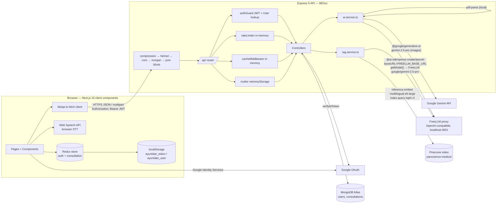
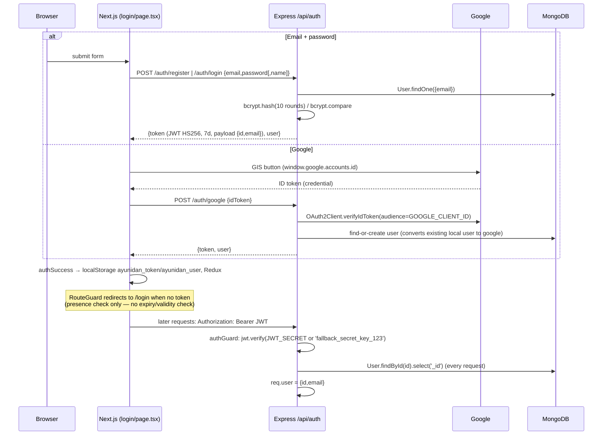

> **ARCHIVED — historical pre-V2 snapshot (2026-09-29, before the V2 hardening).** It describes the codebase *before* the security, grounded-RAG and multimodal work and is kept only as an audit record. See `../../ARCHITECTURE.md` and `../../../README.md` for the current system.

# AyuNidan — Current Architecture (Audit Snapshot)

> Audit date: 2026-09-29. Analysis only — no application code was changed.
> Paths are relative to the repo root (`C:\Users\abhi4\AyuNidan\Ayunidan`).
> `BE/` = `AyuNidan backend/`, `FE/` = `AyuNidan frontend/`.

## 0. What AyuNidan is

AyuNidan is a clinical intake assistant. A logged-in clinician provides patient information in one of these ways:

- uploading a lab report (PDF or image),
- typing notes,
- dictating (browser speech-to-text).

The system then:

1. uses an LLM to extract structured entities: patient demographics, symptoms, medicines and lab values;
2. generates a "doctor-style" summary with a risk level and a 0–100 risk score;
3. stores the result in MongoDB per user.

The app also shows:

- a per-user risk dashboard;
- a list of past consultations with search;
- a "Clinical Term Explainer", a small RAG lookup over a hardcoded 20-term glossary in Pinecone.

## 1. Repository layout

The root is **not** a git repository. Backend and frontend are **two separate git repos**.

```
Ayunidan/
├── AyuNidan backend/              (git repo, 5 commits, last commit 2026-05-30, 10 files with UNCOMMITTED changes)
│   ├── .env                       secrets (git-ignored; never committed — verified via git log)
│   ├── eng.traineddata            5 MB Tesseract English model — NOT referenced anywhere in code
│   ├── PROMPT_ENGINEERING_NOTES.md design notes (describe Gemini + strict JSON; partly out of date vs code)
│   ├── package.json / tsconfig.json
│   └── src/
│       ├── index.ts               Express app bootstrap: middleware chain, /health, error handlers, DB connect + listen
│       ├── config/database.ts     Mongoose connection (pool settings, DNS override, event logging, graceful shutdown)
│       ├── routes/                Route wiring only (index, auth, consultation, upload, voice, user[empty])
│       ├── controllers/           Request handling + business logic (auth, consultation, upload, voice)
│       ├── services/
│       │   ├── ai.service.ts      ALL LLM logic: PDF parse, Gemini image OCR, FreeLLM extraction, summary/risk
│       │   └── rag.service.ts     Pinecone glossary seeding + term-explanation RAG
│       ├── middleware/            authGuard (JWT), in-memory cache, in-memory rate limiter, error handler
│       ├── models/                Mongoose schemas: User, Consultation
│       └── types/                 Shared TS interfaces + Express Request augmentation
└── AyuNidan frontend/             (git repo, Next.js 16 App Router, 5 files with uncommitted changes)
    ├── .env                       NEXT_PUBLIC_API_URL, NEXT_PUBLIC_GOOGLE_CLIENT_ID
    └── src/
        ├── app/                   Routes: / (dashboard), /login, /consultation/new, /consultation/[id]; robot.ts (misnamed)
        ├── components/            Feature components (IntakeForm, DashboardOverview, RecentConsultations,
        │                          MedicalExplainer, Header, Footer, RouteGuard) + shadcn/ui primitives in ui/
        ├── lib/api.ts             Hand-written fetch client for every backend call; attaches JWT from localStorage
        └── store/                 Redux Toolkit: authSlice (token/user persisted to localStorage), consultationSlice
```

### Layers that do NOT exist

These are listed so nobody assumes they are there:

| Layer | Status |
|---|---|
| Tests (unit/integration/e2e) | **None**, in both repos. No test runner is configured. |
| Migrations | None. Mongoose builds indexes automatically at startup. |
| Deployment config (Dockerfile, render.yaml, vercel.json, CI) | None in the repo. Code references `ayunidan.vercel.app` (CORS, robots) and a commented Render URL in `FE/.env`. |
| `.env.example` | None, in either repo. |
| Persistent file storage (S3/GridFS/disk) | None. Uploads live in memory only and are discarded. `Consultation.reportUrls` is never written. |
| Document chunking / embedding of user documents | None. Uploaded documents are **not** indexed. RAG covers only the static glossary. |
| OCR engine (Tesseract) | None. `eng.traineddata` is an orphan file. Image "OCR" is done by Gemini Vision. |
| Background jobs / queues | None. Everything runs synchronously inside the HTTP request. |
| Structured logging / metrics / tracing | None. Only `console.*` and `morgan('dev')`. |
| User routes | `BE/src/routes/user.routes.ts` is an empty router. |

## 2. High-level architecture



### Frontend → backend communication

- Every call goes through `FE/src/lib/api.ts`:
  - `apiFetch()` covers JSON calls (`api.ts:85-98`).
  - Direct `fetch` is used for multipart calls (`uploadMedicalFile` `api.ts:130-167`, `uploadVoiceNote` `api.ts:185-230`).
- The base URL is `NEXT_PUBLIC_API_URL`, falling back to `http://localhost:8080/api`.
- The JWT is read from `localStorage['ayunidan_token']` and sent as `Authorization: Bearer <jwt>` (`api.ts:71-83`).
- All data fetching is client-side (`"use client"` + `useEffect`). No Next.js server components fetch data, and there are no Next.js API routes.

### Middleware chain (`BE/src/index.ts`)

1. `compression()`
2. `helmet({ crossOriginResourcePolicy: 'cross-origin' })`
3. `cors` with origin fixed to `https://ayunidan.vercel.app` in production, or `http://localhost:3000` otherwise. Methods are GET/POST/DELETE.
4. A forced `Connection: keep-alive` header.
5. `morgan('dev')`
6. `express.json({limit:'50mb'})` and `urlencoded`.
7. `/api` router, then `/health`, then `errorHandler`, then a second "global crash" handler. The second handler is unreachable because `errorHandler` always responds.

## 3. Request/response conventions

- Most endpoints respond with `ApiResponse<T> = { success, data?, error?, message? }` (`BE/src/types/index.ts:37-42`).
- **Auth endpoints use a different shape**: `{ message, error }` on failure and `{ token, user }` on success.
- Controllers wrap their own logic in `try/catch` and respond directly. The central `errorHandler` / `AppError` exists but `AppError` is **never thrown** anywhere.
- Status codes in use: 400 validation, 401 auth, 403 ownership, 404 missing, 429 rate limit, 500 everything else.

## 4. Authentication and authorization flow



Authorization is **per-user ownership**. There are no roles, organizations or tenants.

- List and dashboard queries filter by `userId`.
- Get-by-id and delete compare `consultation.userId` with `req.user.id`.
- Several routes have **no** `authGuard`. See the API inventory in `current-engineering-audit.md` §9.

## 5. Database interaction

MongoDB is accessed through Mongoose 9 with a single connection pool (`maxPoolSize 10`, `minPoolSize 2`). There are two collections:

- `users`: email (unique, lowercase), name, password (bcrypt hash, optional), avatar, authProvider (`local` | `google`), googleId, `consultations[]` (never populated), timestamps.
- `consultations`: userId (ref User), patientDetails {name, age, gender}, symptoms[], medicines[], labValues[] (subdocs), rawText, voiceTranscript, summary (required), riskLevel enum, riskScore 0–100, reportUrls[] (never written), processingTime, timestamps.

## 6. Configuration

`dotenv/config` is loaded first in `index.ts`. The table lists the env variables the code reads.

| Variable | Read in | Purpose |
|---|---|---|
| `PORT` | `index.ts:16` | Listen port (default 8080). **Note:** `.env` spells it `Port`. This only works on Windows because Windows env names are case-insensitive. |
| `NODE_ENV` | `index.ts:25`, `database.ts:22,27` | CORS origin, DNS override, mongoose debug |
| `MONGODB_URI` | `database.ts:13` | DB connection (throws if missing) |
| `JWT_SECRET` | `auth.ts:36`, `auth.controller.ts:8` | JWT signing and verification (hardcoded fallback) |
| `GOOGLE_CLIENT_ID` | `auth.controller.ts:7,105` | Google ID token audience |
| `GEMINI_API_KEY` / `GOOGLE_API_KEY` | `ai.service.ts:205-207`, `routes/index.ts:11` | Gemini Vision image extraction; also exposed partially by a debug route |
| `FREELLMAPI_KEY` | `ai.service.ts:277` | FreeLLM proxy key |
| `FREELLM_BASE_URL` | `ai.service.ts:278-279` | FreeLLM proxy URL (default `http://localhost:3001/v1`) |
| `PINECONE_API_KEY` | `rag.service.ts:7,13` | Pinecone (the client is constructed at module load) |
| `NEXT_PUBLIC_API_URL` (FE) | `lib/api.ts`, `login/page.tsx` | Backend base URL |
| `NEXT_PUBLIC_GOOGLE_CLIENT_ID` (FE) | `StoreProvider.tsx`, `login/page.tsx` | GIS client id |

- `GOOGLE_CLIENT_SECRET` is present in `.env` but **never read** by code.
- `OPENAI_API_KEY` and `ANTHROPIC_API_KEY` appear only in commented-out code.

## 7. End-to-end workflows (stages that actually exist)

### 7.1 Upload a report, then create a consultation (main flow)

This is two HTTP calls. The browser sits in the middle and can edit the text.

| # | Stage | File : function | Input | Processing | Output → next |
|---|---|---|---|---|---|
| 1 | Pick or drop file | `FE/src/components/IntakeForm.tsx:94-141` `handleFileChange/handleDrop` | One `File` (`accept=".pdf,.png,.jpg,.jpeg"`) | Redux status `uploading`, toast | `uploadMedicalFile(file)` |
| 2 | HTTP upload | `FE/src/lib/api.ts:130-167` | FormData field `files` | `POST /api/uploads` with Bearer header (the header is ignored because the route is unauthenticated) | multipart request |
| 3 | Multer | `BE/src/routes/upload.routes.ts:8-48` | multipart | `memoryStorage`, ≤5 files, ≤50 MB each, MIME allow-list (pdf, jpeg, png, webp, text/plain, mpeg, wav), `upload.any()`. **No authGuard, no rate limiter.** | `req.files` buffers |
| 4 | Controller | `BE/src/controllers/upload.controller.ts:4-50` `processReport` | `req.files`, `req.body.text/rawText/symptoms` | Keeps pdf/image/audio files and silently drops text/plain; builds `payloadText` | `extractMedicalData(payloadText, mediaFiles)` |
| 5a | PDF text | `BE/src/services/ai.service.ts:151-197` `safelyExtractPDF` | buffer | `pdf-parse@1.1.1`, probes the export shape; logs a 500-char preview of the PDF text | plain text appended as `[Extracted from PDF]` |
| 5b | Image text | `ai.service.ts:199-273` `extractMedicalDataFromImage` | image buffer | `@google/generative-ai` → `gemini-2.5-pro` with the image as base64 `inlineData` and a "transcribe" prompt; returns `""` on error | plain text appended as `[Extracted from Image]` |
| 5c | Audio | — | — | **Ignored.** `extractMedicalData` handles only PDF and images | — |
| 6 | Content guard | `ai.service.ts:369-381` | promptText | Throws if nothing remains after removing the default placeholder string | — |
| 7 | LLM extraction | `ai.service.ts:388-513` | full promptText (no truncation) | Loops over `gpt-4o-mini` → `meta-llama/llama-3.3-70b-instruct` → `qwen/qwen-3-coder-32b-instruct` via **FreeLLM** with `generateText`. The first `{…}` is regex-extracted and passed to `JSON.parse`. Regex fallbacks fill name/age/gender from the raw text | `{patientDetails, symptoms[], medicines[], labValues[], rawText: fullNarrative}` |
| 8 | Response | `upload.controller.ts:34-41` | — | Zeroes the buffers and returns 200 | JSON to browser |
| 9 | Review | `IntakeForm.tsx:103-125` | extracted | Stores `extractedData`; puts narrative + symptoms + medicines into an **editable textarea** | user edits and clicks submit |
| 10 | Create | `IntakeForm.tsx:194-223` → `api.ts:118-128` | `{userId, rawText: textarea, patientDetails, symptoms, medicines, labValues}` | `POST /api/consultations` | — |
| 11 | Guard | `consultation.routes.ts:21` | Bearer JWT | `authGuard` → `aiRateLimiter` (10/min/IP) | `req.user` |
| 12 | Controller | `consultation.controller.ts:20-104` `createConsultation` | body | If the client sent any structured data, it is **trusted as-is**. Otherwise `extractMedicalData(rawText)` runs server-side | extractedData |
| 13 | Summary + risk | `ai.service.ts:520-613` `generateClinicalSummary` | extracted data + rawText + voiceTranscript as JSON | FreeLLM `gpt-4o-mini`, temperature 0.2. Strips ```` ``` ```` fences, regex-extracts JSON, normalizes `moderate` to `medium`, clamps the score. **On any failure it returns a placeholder summary with `riskLevel:'low', riskScore:0`** | `{summary, riskLevel, riskScore}` |
| 14 | Persist | `consultation.controller.ts:81-93` | — | `Consultation.create(...)` with `processingTime` | saved doc |
| 15 | Render | `FE/src/app/consultation/[id]/page.tsx` | redirect to `/consultation/:id` | `GET /api/consultations/:id` (cached 120 s) | summary shown as plain text (React-escaped) |

### 7.2 Typed or dictated notes only

1. `IntakeForm` uses the browser **Web Speech API** (`webkitSpeechRecognition`) for dictation (`IntakeForm.tsx:70-91`). The audio captured by `MediaRecorder` is never sent to the backend.
2. On submit with no upload, the structured arrays are empty, so the backend runs step 12's server-side `extractMedicalData(rawText)` and then steps 13–15.
3. `BE /api/voice/transcribe` and `FE uploadVoiceNote()` exist but are **not called from the UI**. If called, the audio is dropped, and the LLM receives only the instruction string with no patient data (see audit).

### 7.3 Clinical term explainer (the only RAG)

| # | Stage | File : function | Detail |
|---|---|---|---|
| 1 | UI | `FE/src/components/MedicalExplainer.tsx` (mounted in `consultation/[id]/page.tsx:221`) | User types a term |
| 2 | HTTP | `api.ts:253-266` | `GET /api/consultations/explain?term=…` (authGuard, no rate limiter, no cache) |
| 3 | Embed query | `rag.service.ts:99-110` | `pinecone.inference.embed('multilingual-e5-large', [term], {inputType:'query'})` |
| 4 | Retrieve | `rag.service.ts:112-130` | `index('panscience-medical').query({topK:2, includeMetadata:true})`. If the **best** score is > 0.5, both matches' `metadata.text` are joined as context. Otherwise a "No specific data found" sentinel is used |
| 5 | Prompt | `rag.service.ts:133-148` | LangChain `PromptTemplate` (the only LangChain usage in the codebase). Grounded when context exists, otherwise it must prefix the answer with "Based on general medical knowledge:" |
| 6 | Generate | `rag.service.ts:150-155` | `getModel()` → **FreeLLM** `google/gemini-2.5-pro`, temperature 0.2 |
| 7 | Response | `consultation.controller.ts:278-300` | `{term, explanation}`. No sources or scores are returned |

The knowledge base is seeded via `POST /api/consultations/seed-rag`, which is **unauthenticated**. It embeds 20 hardcoded definitions (`rag.service.ts:29-58`) with `inputType:'passage'` and upserts them with fixed ids `'1'..'20'`, so re-seeding is idempotent.

### 7.4 Dashboard and history

- `GET /consultations/dashboard` runs `aggregate([$match userId, $group riskLevel {count, avg riskScore}, $project round 1])` (`consultation.controller.ts:146-192`). It is cached 60 s.
- `GET /consultations?page&limit&search` does `find({userId [, patientDetails.name: /search/i]}).sort(createdAt:-1).skip.limit.lean()` (`:106-144`). It is cached 30 s.
  - The FE never sends `page` or `limit`, so it only ever receives the **10 newest** records and paginates them client-side (`RecentConsultations.tsx:100-127`).
- If the dashboard call fails, the FE silently shows **hardcoded demo numbers** (`DashboardOverview.tsx:146-155`).

## 8. Storage summary

| Data | Where | Lifetime |
|---|---|---|
| Users, consultations | MongoDB | Permanent (hard delete via `DELETE /consultations/:id`; no UI calls it) |
| Uploaded files | Node process memory (multer) | Duration of the request; buffers are zeroed afterwards |
| Glossary vectors | Pinecone `panscience-medical` | Permanent |
| API response cache | In-process `Map` (max 100 entries, TTL 30/60/120 s) | Process lifetime |
| Rate limit counters | In-process `Map` (never pruned) | Process lifetime |
| JWT + user profile | Browser `localStorage` | Until logout (the JWT itself expires after 7 days) |

## 9. Important repository-state caveat

The backend **working tree differs from its last commit**:

- **HEAD (committed 2026-05-30):** `ai.service.ts` used the Vercel AI SDK `generateObject` with **Zod schemas**. It picked Gemini (`gemini-2.5-flash-lite`), OpenAI (`gpt-4o`) or Anthropic by which key was present, and sent images, PDFs and audio **natively** to the multimodal model. **FreeLLM does not exist at HEAD.**
- **Working tree (uncommitted):** that code is commented out (`ai.service.ts:1-127`) and replaced with the FreeLLM + `generateText` + regex-JSON version described above. `pdf-parse` was also downgraded from `^2.4.5` to `^1.1.1`, and `patientDetails` and search were added.

Which version is deployed cannot be determined from the repository.
