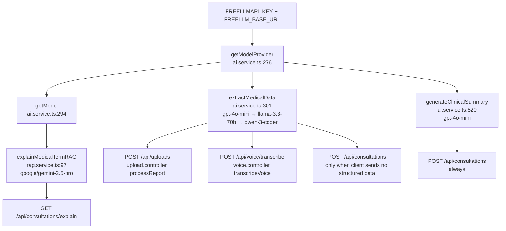

> **ARCHIVED — historical pre-V2 snapshot (2026-09-29, before the V2 hardening).** It describes the codebase *before* the security, grounded-RAG and multimodal work and is kept only as an audit record. See `../../ARCHITECTURE.md` and `../../../README.md` for the current system.

# AyuNidan — Current Engineering Audit

> Audit date: 2026-09-29. Analysis only. Nothing was modified, installed or removed.
> `BE/` = `AyuNidan backend/`, `FE/` = `AyuNidan frontend/`. Line numbers refer to the current working tree.
> Checks run during the audit: `tsc --noEmit` on the backend (**passes, 0 errors**), a grep-based secret scan of `src/` (no hardcoded keys found), and `git log` on `.env` (never committed).
> Findings marked **(verified)** were confirmed by reading the exact code path. Findings marked **(likely)** follow from the code but were not reproduced at runtime.

See `current-architecture.md` for the layout, diagrams and step-by-step flows.

---

## 4. AI / LLM implementation (working tree)

| Aspect | Current reality |
|---|---|
| Providers actually called | 1) **FreeLLM proxy**, an OpenAI-compatible endpoint, via `@ai-sdk/openai` `createOpenAI({baseURL: FREELLM_BASE_URL})`. 2) **Google Gemini** directly, via `@google/generative-ai` (images only). 3) **Pinecone Inference** for embeddings. |
| Models | Extraction: `gpt-4o-mini` → `meta-llama/llama-3.3-70b-instruct` → `qwen/qwen-3-coder-32b-instruct` (sequential fallback, `ai.service.ts:307-311`). Summary: `gpt-4o-mini` (`:531`). RAG answer: `google/gemini-2.5-pro` via FreeLLM (`getModel()` default `"multimodal"`, `:294-299`). Image transcription: `gemini-2.5-pro` direct (`:220`). Embeddings: `multilingual-e5-large` (`rag.service.ts:18`). |
| SDK | Vercel AI SDK `ai@6.0.193` `generateText` only. `generateObject` is imported but unused. LangChain is used only for `PromptTemplate`. |
| API flavour **(verified in SDK source)** | In `@ai-sdk/openai@3.x`, calling `provider(modelId)` creates a **Responses API** model (`POST {baseURL}/responses`), not Chat Completions. Many OpenAI-compatible proxies implement only `/chat/completions`. If FreeLLM is one of them, every FreeLLM call fails. The code does not use `provider.chat(...)`. |
| Prompts | Inline template strings. Extraction (`:399-426`) shows a JSON skeleton and puts the raw data in the user message. Summary (`:535-563`) lists rules and the required closing disclaimer. Image (`:232-252`) says "transcribe, don't summarize". RAG (`rag.service.ts:133-143`) uses grounded-or-labeled fallback. No system messages are used. |
| Structured output | **Not enforced.** The code does `text.match(/\{[\s\S]*\}/)` then `JSON.parse`. There is no JSON mode and no schema. |
| Schema validation | **None at runtime.** `ClinicalSummarySchema` (Zod, `:139-143`) is defined but never used. Validation is hand-rolled: `Array.isArray` checks, riskLevel whitelist with `moderate`→`medium`, and score clamping. `labValues` items are not validated, so empty `name`/`value` strings can fail Mongoose `required` at save time **(likely)**. |
| Retries / fallback | Extraction: manual model-fallback loop (3 models). The AI SDK's default `maxRetries` (2) also applies per call, so the worst case is 9 attempts. Summary: one model, then a *silent* fallback value. RAG: none. |
| Timeouts | **None.** There is no `abortSignal` or timeout on any LLM, Gemini or Pinecone call. |
| Temperature | Summary 0.2, RAG 0.2, extraction **default** (unset). Image: default. |
| Token handling | **None.** The full PDF text and any number of images are concatenated into one prompt, with no truncation, counting, or `maxOutputTokens`. |
| Context construction | Extraction: user text + `[Extracted from PDF]` / `[Extracted from Image]` blocks. Summary: `JSON.stringify(payload)` of the extracted fields + rawText + voiceTranscript. |
| Retrieval / embeddings / vector DB | Only for the glossary: Pinecone integrated inference, `topK 2`, and a score gate `> 0.5` on the best match only (the second match is included unconditionally). No namespaces, no metadata filtering, no reranking. |
| Source attribution | **None.** Neither retrieved ids nor scores are returned to the client. The only provenance signal is the "Based on general medical knowledge:" prefix instruction. |
| Hallucination controls actually present | (a) the "don't summarize, just transcribe" image prompt; (b) grounded-or-labeled RAG prompt; (c) required disclaimer "Generated by AI - Subject to Physician Review"; (d) low temperature on summary and RAG; (e) **human in the loop**: the clinician sees and edits extracted text before creating the consultation. The extraction prompt no longer contains "do not infer/invent" (that wording exists only in `PROMPT_ENGINEERING_NOTES.md` and the committed version). |
| Deterministic fallbacks | Regex extraction of name, age and gender from raw text when the LLM leaves them blank (`:453-483`). |

**Documentation drift:** `PROMPT_ENGINEERING_NOTES.md` describes Gemini, `response_mime_type: application/json`, temperature 0.1 and strict schemas. That matches the **committed** code, not the current working tree.

---

## 5. FreeLLM integration: dependency map

The key value is not reproduced here. Only presence is reported.

| Item | Finding |
|---|---|
| Env vars | `FREELLMAPI_KEY` = PRESENT, `FREELLM_BASE_URL` = PRESENT (host is `localhost`, i.e. a proxy on the dev machine) |
| Read at | `BE/src/services/ai.service.ts:276-289` `getModelProvider()`. This is the only place. It throws if the key is missing. The default URL is `http://localhost:3001/v1`. |
| Client / SDK | `createOpenAI` from `@ai-sdk/openai`, calling `generateText` from `ai` |
| Git status | **Exists only in uncommitted working-tree changes.** HEAD has no FreeLLM code. |
| Frontend | No reference. |

### Call graph

### Impact of removal

- **FreeLLM is on the production code path for every AI feature except image transcription and embeddings.** Extraction, summary/risk and the RAG answer all depend on it.
- Removing the env vars without replacing the calls breaks the following:
  - Uploads: `extractMedicalData` throws → 500.
  - Consultation create: extraction throws → 500. If the client sent structured data, the summary silently degrades to "Unable to generate" / `low` / `0`, and the consultation is **still saved**.
  - The explainer returns 500.
- Not affected: auth, dashboard, list/get/delete, Pinecone seeding, Gemini image transcription.
- There are no FreeLLM-specific npm packages. `@ai-sdk/openai` is shared with the (commented) OpenAI path, so it should not be uninstalled blindly.
- The swap point is small: `getModelProvider()` and `getModel()` plus three model-name literals. The HEAD version of `ai.service.ts` is a ready reference for a direct-provider implementation.

---

## 6. Database

| Aspect | Finding |
|---|---|
| Tech | MongoDB (Atlas, via SRV URI) + Mongoose 9, `strictQuery: true` |
| Connection | One pool: `maxPoolSize 10`, `minPoolSize 2`, `serverSelectionTimeoutMS 5000`, `socketTimeoutMS 45000`, `heartbeatFrequencyMS 10000` (`database.ts:4-10`). Error, disconnect and reconnect events are logged. SIGINT/SIGTERM close the connection. The process exits on initial connect failure, and the server starts listening only after the DB connects (`index.ts:63-67`). Non-production overrides DNS to 8.8.8.8/1.1.1.1 (a known workaround for Atlas SRV lookups on some ISPs). |
| Relationships | `Consultation.userId → User` (ref, required, indexed). `User.consultations[]` exists but is **never written**, so it is a dead back-reference. |
| Indexes (Consultation) | `userId` · `riskLevel` · `{patientDetails.name:1}` · `{userId:1, createdAt:-1}` · `{userId:1, riskLevel:1}` · `{riskLevel:1, createdAt:-1}` · text `{symptoms, medicines, summary}` |
| Index usage | `{userId, createdAt}` serves the list query (equality + sort). `{userId, riskLevel}` serves the dashboard `$match`+`$group`. The single-field `userId` is redundant (prefix of the compounds). `riskLevel`, `{riskLevel, createdAt}` and the **text index are not used by any query**. `{patientDetails.name}` cannot serve an unanchored case-insensitive regex. Every unused index adds write cost. |
| Indexes (User) | `email` has `unique` **and** `index: true` **and** a compound `{email, createdAt}`, which is redundant. `googleId` is sparse and indexed. |
| Constraints | enum `riskLevel`; `riskScore` min 0 / max 100; LabValue `name`/`value` required; `summary` required. No length limits on any string. Mongoose would store an unbounded 50 MB `rawText` (MongoDB's 16 MB doc limit would reject it). |
| Queries | `find+sort+skip+limit+lean` (offset pagination); `aggregate` for the dashboard; `findById` + ownership check; delete is check-then-`findByIdAndDelete` (two round-trips, not atomic, but safe because ownership is immutable). |
| Transactions | None, and not needed at present (single-document writes). |
| Migrations | None. `patientDetails` was added without a backfill; older documents rely on schema defaults at read time only for new saves. |
| Per-request DB cost | `authGuard` does `User.findById` on **every** authenticated request (`auth.ts:41`), so each API call costs at least one extra query. It gives immediate revocation on user deletion. |

---

## 7. Authentication and multi-tenancy

| Aspect | Finding |
|---|---|
| Mechanism | Stateless JWT (HS256, `jsonwebtoken`), 7-day expiry, payload `{id, email}` (`auth.controller.ts:11-13`). No refresh tokens and no revocation list. |
| Local auth | bcryptjs with 10 salt rounds. Generic "Invalid credentials" on a missing user or wrong password. Login is blocked for Google-linked accounts. |
| Google auth | Server-side `OAuth2Client.verifyIdToken` with an audience check (correct pattern). `email_verified` is not checked. An existing **local** account with the same email is silently converted to `google`, and its password stays in the DB (`:125-131`). |
| Token validation | `authGuard` checks the `Bearer` format, calls `jwt.verify`, then checks that the user still exists. It uses the **fallback secret `'fallback_secret_key_123'`** if `JWT_SECRET` is unset (`auth.ts:36`, `auth.controller.ts:8`). |
| Client storage | JWT + user in `localStorage` (readable by any XSS). `RouteGuard` treats token *presence* as authenticated. There is no expiry check and no 401 → logout handling. |
| Authorization | Ownership checks only. No roles. |
| Tenancy | **Single-tenant per user.** There is no organization or tenant concept. Isolation is enforced **in application code** by adding `userId` to queries or comparing `consultation.userId`. There is no DB-level isolation. |
| Isolation break **(verified)** | `cacheMiddleware` keys on `method + originalUrl + query` with **no user id** (`cache.ts:46`), and it is mounted **before** the controllers' ownership logic:  • `GET /consultations` (30 s) and `GET /consultations/dashboard` (60 s) have identical URLs for every user, so user B receives **user A's patient list and risk stats**.  • `GET /consultations/:id` (120 s): once anyone loads a record, any authenticated user who requests that id gets it from cache, **bypassing the 403 check**.  • The cache also stores error bodies (it wraps `res.json` unconditionally), so a 403 or 404 can be served to the rightful owner.  • `cache.invalidate()` is never called, so a new or deleted consultation stays invisible or stale until TTL expiry. |
| Vector isolation | N/A. The Pinecone index holds only a global public glossary, and no user data is embedded. |

---

## 8. Document processing

| Aspect | Finding |
|---|---|
| Accepted by the route | pdf, jpeg, png, webp, text/plain, audio/mpeg, audio/wav (MIME from the client header, not magic bytes) |
| Offered by the UI | `.pdf,.png,.jpg,.jpeg`, one file at a time |
| Actually processed | **PDF** via `pdf-parse@1.1.1` (text layer only). **Images** via Gemini Vision transcription. text/plain files pass the filter but are **silently discarded** (`upload.controller.ts:20-28`). Audio passes through to `extractMedicalData` and is **silently ignored** there. |
| OCR | No local OCR. A scanned or image-only PDF yields empty text, because it is never sent to Vision. `eng.traineddata` is unused. |
| Cleaning | None. |
| Chunking / embeddings / vector storage of documents | **None.** Uploaded content is used once as prompt text and then discarded. |
| Metadata | Only what the LLM extracts, plus `processingTime`. No filename, hash, page count, or source mapping per value. |
| Storage | Not persisted. `reportUrls` is unused. |
| Status / lifecycle | None. The request is synchronous with no job status. |
| Duplicate handling | None. The same report can create unlimited consultations. |
| Failure handling | A PDF parse failure is logged and swallowed, and processing continues with the other content. Image failure returns `""`, which is logged and swallowed. If nothing is left, the code throws "No medical data could be extracted". Model failures trigger the fallback chain. |
| Weaknesses | Up to 5 × 50 MB files are held in memory per request **on an unauthenticated route**. Images are transcribed sequentially. There is no page or size cap on prompt text. PHI is logged verbatim (see §15). pdf-parse v1 is unmaintained and was downgraded from v2 to work around an export-shape change (see the probing code at `:162-179`). |

---

## 9. API inventory

All routes are under `/api` except `/health`.

| Method | Route | Purpose | Auth | Middleware | Input | Output | Notes |
|---|---|---|---|---|---|---|---|
| GET | `/health` | Liveness | none | — | — | status, uptime, **memoryUsage**, timestamp | Exposes process memory stats |
| GET | `/api/debug-env-tokens-isolated` | Debug | **none** | — | — | `hasKey`, **first 10 chars of GEMINI_API_KEY**, key length, NODE_ENV | **Leaks key prefix publicly** |
| POST | `/api/auth/register` | Local sign-up | none | — | `{name,email,password}` | 201 `{token,user}` | No validation of email format or password strength. 500 response includes the raw `error` object |
| POST | `/api/auth/login` | Local login | none | — | `{email,password}` | `{token,user}` | No rate limit (brute force possible) |
| POST | `/api/auth/google` | Google login | none | — | `{idToken}` | `{token,user}` | Account-linking caveat (§7) |
| GET | `/api/consultations/dashboard` | Risk stats | JWT | generalRL, **cache 60 s** | — | `{total, distribution[]}` | Cross-user cache leak |
| GET | `/api/consultations/explain?term=` | RAG explainer | JWT | — | `term` | `{term, explanation}` | No rate limit even though it calls an LLM. No input length cap |
| POST | `/api/consultations` | Create consultation (summary + risk) | JWT | aiRL | `{rawText, patientDetails?, symptoms?, medicines?, labValues?, voiceTranscript?}` | 201 consultation | Trusts client-supplied structured data. Saves even when the summary failed |
| GET | `/api/consultations?page&limit&search` | List own | JWT | generalRL, **cache 30 s** | query | `Consultation[]` | `limit` is unbounded. `search` goes into `$regex` unescaped. No total count is returned |
| GET | `/api/consultations/:id` | Get one | JWT | **cache 120 s** | id | consultation | Cache bypasses the ownership check |
| DELETE | `/api/consultations/:id` | Delete own | JWT | generalRL | id | message | Not used by the FE. Cache not invalidated |
| POST | `/api/consultations/seed-rag` | Seed glossary | **none** | — | — | message | Anyone can trigger Pinecone embed and upsert calls |
| POST | `/api/uploads` | Extract entities from files/text | **none** | multer | multipart (`any` field) + `text/rawText/symptoms` | extracted entities | **No auth and no rate limit**, yet it calls paid LLMs with 250 MB of buffers per request |
| POST | `/api/voice/transcribe` | Extract from audio | **none** | aiRL, multer single `audio` ≤25 MB | audio | entities | Audio is ignored, so the LLM receives no patient data (hallucination risk). Unused by the FE |
| — | `/api/users/*` | — | — | — | — | — | Empty router |

The frontend's `CORS methods` list is GET/POST/DELETE, which is consistent with the routes.

---

## 10. Dependencies

### Backend (`BE/package.json`)

| Category | Actively used | Declared but unused / suspicious |
|---|---|---|
| Server | express 5, cors, helmet, morgan, compression, dotenv, multer | `express-validator` (never imported) |
| DB | mongoose | — |
| Auth / security | jsonwebtoken, bcryptjs, google-auth-library | — |
| AI / LLM | `ai` (generateText), `@ai-sdk/openai` (FreeLLM client), `@google/generative-ai` (Vision) | `@ai-sdk/google`, `@ai-sdk/anthropic` (only in commented code); `@anthropic-ai/sdk`, `openai` (never imported) |
| RAG / vector | `@pinecone-database/pinecone`, `@langchain/core` (PromptTemplate only) | `langchain`, `@langchain/openai`, `@langchain/pinecone` (never imported) |
| Parsing | `pdf-parse@^1.1.1` (downgraded from ^2.4.5, uncommitted) | — |
| Phantom dep | **`zod` is imported in `ai.service.ts` but not declared.** It resolves only as a transitive dependency. | — |
| Misplaced | `typescript` and `@types/compression` are in `dependencies` | — |
| Dev | nodemon, ts-node, @types/* | — |
| Testing | **none** | — |
| Deployment | **none** | — |
| FreeLLM-specific | none (it reuses `@ai-sdk/openai`) | — |
| Orphan asset | `eng.traineddata` (5 MB, no tesseract dependency) | — |

The `.gitignore` line `/package-lock.json (Optional: ...)` is a malformed pattern and matches nothing, so the lockfile *is* tracked, which is correct.

### Frontend (`FE/package.json`)

| Actively used | Declared but never imported |
|---|---|
| next 16, react 19, @reduxjs/toolkit, react-redux, @react-oauth/google (`GoogleOAuthProvider`), framer-motion, lucide-react, sonner, radix-ui (shadcn/ui), class-variance-authority, clsx, tailwind-merge, next-themes (sonner wrapper), tailwindcss 4 | axios, gsap, react-dropzone, react-hook-form, @hookform/resolvers, zod, tailwindcss-animate, tw-animate-css, `shadcn` (a CLI in runtime deps). `useGoogleLogin` is imported but unused |

---

## 11. Configuration and secrets

Values are never printed. Only presence is reported.

| Variable | `.env` status | Referenced in code? |
|---|---|---|
| `Port` (sic) | PRESENT | Code reads `PORT` (only matches on Windows) |
| `MONGODB_URI` | PRESENT | yes |
| `PINECONE_API_KEY` | PRESENT | yes |
| `GEMINI_API_KEY` | PRESENT | yes (Vision + **debug route leak**) |
| `FREELLMAPI_KEY` | PRESENT | yes |
| `FREELLM_BASE_URL` | PRESENT (localhost) | yes |
| `JWT_SECRET` | PRESENT (64 chars) | yes (with hardcoded fallback) |
| `GOOGLE_CLIENT_ID` | PRESENT | yes |
| `GOOGLE_CLIENT_SECRET` | PRESENT | **not referenced** |
| `NODE_ENV` | NOT PRESENT | yes. When unset, CORS uses localhost and DNS override and mongoose debug stay off/on by branch |
| `OPENAI_API_KEY` / `ANTHROPIC_API_KEY` / `GOOGLE_API_KEY` | NOT PRESENT | only commented code / Vision fallback |
| FE `NEXT_PUBLIC_API_URL`, `NEXT_PUBLIC_GOOGLE_CLIENT_ID` | PRESENT | yes (public by design) |

- `.env` files are git-ignored in both repos, and backend history shows they were never committed.
- No API keys are hardcoded in `src/`.
- The one hardcoded secret is the **JWT fallback** `'fallback_secret_key_123'`.
- There is no startup validation of required env vars except `MONGODB_URI`. Pinecone only warns.
- There is no `.env.example`.

---

## 12. Error handling

| Area | Good | Weak |
|---|---|---|
| Validation | ObjectId validity checks before queries (400). Required-field checks in auth. Multer errors mapped to 400 | No schema validation of request bodies (express-validator unused). Pagination and search are unvalidated |
| API errors | Consistent `{success,error}` in consultation, upload and voice | Auth uses a different shape. Raw error objects are returned from register, login and google. `error.message` is passed straight to clients (can leak internals) |
| Central handler | `AppError` class and `errorHandler` exist | `AppError` is never thrown. The second "global crash" handler is dead code |
| DB errors | Connection lifecycle logging, fail-fast at boot | Mongoose ValidationError on save surfaces as a generic 500 |
| LLM failures | Model fallback chain; empty-content guard; RAG failure → 500 | **Summary failure silently becomes `riskLevel:'low', riskScore:0` and is persisted**. In a clinical risk tool, a failure is recorded as "low risk" with no flag. Vision failure returns `""` silently |
| Document failures | Per-file try/catch so one bad file doesn't sink the rest | The user is not told which file failed. Audio and text files are dropped silently |
| Timeouts | Mongo server selection 5 s | **No timeouts** on LLM, Vision or Pinecone. A hung provider holds the request, and the 3-model loop × SDK retries multiplies latency |
| Logging | `morgan('dev')`, emoji-tagged console logs | Unstructured, no request ids, no levels. Logs full PHI (see §15). `pdf-parse` module dump at import time (`ai.service.ts:145-149`) |
| Frontend | Toasts on upload and create failures | API helpers swallow errors and return `[]` / `null`. The dashboard shows **fake demo data** on failure. No 401 handling |

---

## 13. Testing

There are **no tests of any kind** in either repo:

- no test runner, no `test` script, no fixtures, no CI;
- no unit, integration, API, auth, RAG/LLM or document-processing tests;
- no evaluation set for extraction accuracy or risk classification.

The only automated check available is `tsc` (backend passes with `strict: true`) and `next lint` on the frontend.

---

## 14. Performance (from code reading; nothing measured)

| Observation | Location | Effect |
|---|---|---|
| Extra `User.findById` per authenticated request | `auth.ts:41` | +1 DB round-trip per call |
| Fully synchronous AI pipeline inside HTTP request | `upload.controller`, `createConsultation` | Latency = PDF parse + N × Vision + up to 3 models × SDK retries, with no timeout. Ties up connections on slow providers |
| Sequential image transcription | `ai.service.ts:316-366` | Linear in the number of images |
| New `GoogleGenerativeAI` client per image | `:215` | Minor. Provider objects are cheap, but this could be hoisted |
| `getModelProvider()` rebuilt on each call | `:276` | Negligible |
| Up to 250 MB of buffers in memory per upload; `express.json` 50 MB | `upload.routes.ts:11`, `index.ts:41` | Memory pressure; easy memory DoS on an unauthenticated route |
| Unbounded prompt size | `extractMedicalData` | Cost and latency grow with document size; may exceed context windows |
| Offset pagination; unbounded `limit` | `getConsultations` | Fine at current scale. `limit=100000` is allowed |
| Unanchored case-insensitive regex search | `:126` | Cannot use an index. Scans all of that user's documents |
| Unused indexes (text, riskLevel ×2, userId single, patientDetails.name) | `Consultation.ts` | Write amplification and RAM for no read benefit |
| In-memory cache: FIFO eviction (comment says "LRU-like"), 100 entries, per process | `cache.ts` | Low hit rate across users. Wrong across instances. Correctness bug (§7) |
| Rate-limit `Map` never pruned | `rateLimiter.ts:4` | Slow unbounded growth (one entry per IP ever seen) |
| Verbose console logging of large prompts and responses | `ai.service.ts` | Synchronous stdout writes of large strings on the hot path |
| Good: `.lean()` on reads; aggregation done in DB; compression; connection pooling; `minPoolSize` keeps warm connections | — | — |

---

## 15. Security review (code level)

| # | Severity | Issue | Location |
|---|---|---|---|
| S1 | **Critical** | Cross-user data exposure via user-agnostic response cache (lists, dashboard, and by-id bypassing the 403 check) | `middleware/cache.ts:46`, `consultation.routes.ts:18,22,23` |
| S2 | **High** | Public debug endpoint returns the first 10 chars and length of `GEMINI_API_KEY` plus NODE_ENV | `routes/index.ts:10-19` |
| S3 | **High** | Unauthenticated, un-rate-limited `/api/uploads` triggers paid LLM calls and holds up to 250 MB in memory (cost and DoS abuse) | `upload.routes.ts` |
| S4 | **High** | Unauthenticated `/voice/transcribe` and `/consultations/seed-rag` | `voice.routes.ts:22`, `consultation.routes.ts:27` |
| S5 | **High** | Hardcoded JWT fallback secret: if `JWT_SECRET` is ever unset in a deployment, anyone can forge tokens | `auth.ts:36`, `auth.controller.ts:8` |
| S6 | **High** | PHI written to logs: full prompt text, PDF previews, Vision output, raw LLM responses, mongoose debug queries | `ai.service.ts:183-188,259-262,383-386,431-434,566-567` |
| S7 | Medium | PHI sent to a third-party proxy (FreeLLM) whose data handling is unknown; the base URL is plain `http` | `ai.service.ts:276-289` |
| S8 | Medium | Prompt injection: document and user text are concatenated straight into prompts with no delimiters or instruction hierarchy. A malicious PDF can steer extraction or the risk level | `:399-426`, `:535-563` |
| S9 | Medium | Client-controlled structured data is persisted without validation (can inject arbitrary symptoms/labs; the summary is then based on them) | `consultation.controller.ts:41-58` |
| S10 | Medium | Regex injection / ReDoS in search (`$regex` with raw user input) | `consultation.controller.ts:126` |
| S11 | Medium | Rate limiter keyed by `req.ip` without `trust proxy`: behind Render/Vercel proxies, all users may share one bucket (or it is trivially bypassed). Per-process only. No limit on `/auth/login` | `rateLimiter.ts:8` |
| S12 | Medium | JWT in `localStorage` (XSS-exfiltratable), 7-day lifetime, no revocation | `authSlice.ts`, `api.ts:77` |
| S13 | Medium | Google login converts an existing local account without an `email_verified` check or user confirmation | `auth.controller.ts:125-131` |
| S14 | Low | MIME-only file validation (no magic-byte check); `upload.any()` accepts arbitrary field names | `upload.routes.ts` |
| S15 | Low | Raw error objects and messages returned to clients | `auth.controller.ts:49,88,140` etc. |
| S16 | Low | `/health` exposes memory usage; no password policy; no email normalisation before `findOne` (the schema lowercases on save, so a login with a different case fails rather than being bypassed) | various |
| — | OK | Path traversal: not applicable (memoryStorage, no filesystem writes; the `fs.readFileSync(file.path)` branch is unreachable). NoSQL operator injection is mitigated by `strictQuery` and ObjectId validation on ids (but `email` in `findOne({email})` accepts objects; Mongoose casts to string for String paths). Unsafe model output: rendered as React text, so no XSS. CORS is restricted to one origin. `helmet` is enabled. bcrypt is used. `.env` was never committed | — |

---

## 16. Engineering quality

| Dimension | Assessment (with evidence) |
|---|---|
| Modularity | Clear routes → controllers → services → models split in the backend. However, `ai.service.ts` is a 613-line file mixing PDF parsing, Vision OCR, provider config, prompt text, parsing and validation, and 127 lines of commented-out code |
| Separation of concerns | Business rules live in controllers (e.g. the "trust client extraction" decision in `createConsultation`). Prompts are hardcoded strings next to transport code |
| Naming | Mostly clear (`authGuard`, `extractMedicalData`). Some inconsistencies: `robot.ts` (Next.js expects `robots.ts`, so it is inert); `transcribeVoice` doesn't transcribe; `FREELLMAPI_KEY` vs `FREELLM_BASE_URL` |
| Type safety | Backend `strict: true` and compiles cleanly, but it relies heavily on `any` (`payload: any`, `patientDetails: any`, `queryFilter: any`, `res: any`). The `Request.user` augmentation is declared **three times** with different shapes (`auth.ts`, `consultation.controller.ts`, `types/index.d.ts`) |
| Validation | Hand-rolled and partial. Zod is present but unused at runtime; express-validator is installed but unused |
| Testability | Low. Module-level side effects (Pinecone client, console dumps, `process.on` handlers at import). No dependency injection for LLM or DB clients. No tests |
| Scalability | In-process cache and rate limiter break under multiple instances. The synchronous LLM pipeline runs in the request |
| Observability | `console.log` + morgan only. No request ids, latency or token metrics, or LLM tracing. `processingTime` is stored per consultation, which is a useful start |
| Config management | Scattered `process.env` reads, no central validated config, no `.env.example`, a hardcoded production origin, and the `Port`/`PORT` mismatch |
| Repo hygiene | Two separate repos. The backend's current behaviour is **uncommitted**. Frontend `.next/` is present locally (ignored). There are leftover debug logs and some mixed-language comments |

---

## 17. Strong engineering work already present (code-backed)

These items are supported by the code and suitable for a resume or interview discussion.

1. **End-to-end multimodal clinical pipeline.**
   - PDF text-layer parsing plus Vision-model transcription of images are normalised into one text context.
   - This feeds LLM entity extraction (demographics, symptoms, medicines, lab values with abnormal flags) and a second-stage summary with risk classification.
   - Two-stage design (extract → summarise) is visible in `ai.service.ts`.
2. **Human-in-the-loop design.** Extraction is a separate endpoint from consultation creation. The clinician reviews and edits the AI output before anything is persisted (`IntakeForm.tsx`, two API calls).
3. **Multi-model resilience.**
   - Ordered fallback across three LLMs (`ai.service.ts:307-513`).
   - Defensive parsing of free-text LLM output: fence stripping, JSON extraction, enum normalisation (`moderate`→`medium`), score clamping.
   - Deterministic regex backfill for demographics.
4. **A working RAG component.**
   - Pinecone integrated inference with asymmetric `passage`/`query` embeddings from `multilingual-e5-large`.
   - Similarity threshold gating.
   - A grounded-vs-general-knowledge prompt that makes the provenance of the answer explicit.
   - Idempotent seeding via fixed ids.
5. **Provider-agnostic design (committed version).** HEAD used the Vercel AI SDK `generateObject` with **Zod schemas**. It picked Gemini, OpenAI or Anthropic automatically by available key and sent native multimodal parts (image, PDF, audio).
6. **Sensible MongoDB modelling.**
   - Compound indexes aligned with the two hot queries: `{userId, createdAt:-1}` for the sorted list and `{userId, riskLevel}` for the dashboard aggregation.
   - Server-side `$group`/`$avg`/`$round` aggregation.
   - `.lean()` reads; tuned connection pool.
   - Fail-fast boot (listen only after connect) and graceful shutdown.
7. **Layered Express hardening.** helmet, a CORS allow-list, compression, a payload size cap, multer MIME allow-lists and size/count limits, and per-route middleware composition (auth → rate limit → cache → controller).
8. **Two-tier rate limiting.** Stricter limits for AI endpoints (10/min) than for general endpoints (100/min), with a `retryAfter` hint (`rateLimiter.ts`).
9. **Custom TTL cache middleware** that transparently wraps `res.json`, with `X-Cache: HIT/MISS` headers. The mechanism is sound; only the key design needs a user scope.
10. **Dual auth.** bcrypt local auth plus **server-side verified** Google ID tokens (audience check), unified into one JWT scheme. A per-request user-existence check means deleted users lose access immediately.
11. **Per-user data isolation in queries.** Ownership checks return 403 on get and delete; ObjectId validation happens before queries.
12. **Latency instrumentation.** `processingTime` is recorded per consultation.
13. **PHI minimisation in memory.** Upload buffers are zeroed after processing and never written to disk.
14. **Modern frontend architecture.**
    - Next.js 16 App Router with the React Compiler and Redux Toolkit slices.
    - A typed API client, a route guard, and a dynamic import (`ssr:false`) for the heavy intake form.
    - Browser-native streaming speech-to-text for dictation.
15. **Documented prompt-engineering rationale** (`PROMPT_ENGINEERING_NOTES.md`): temperature strategy, strict JSON, abstain-with-null, and context boundaries.

---

## 18. Current Engineering Gaps

### HIGH

| # | Gap | Why it matters |
|---|---|---|
| H1 | User-agnostic response cache leaks patient data across users and bypasses the 403 check. It is never invalidated and caches error bodies | PHI breach; correctness |
| H2 | Unauthenticated `/uploads`, `/voice/transcribe`, `/seed-rag`, and the key-prefix debug route | Cost abuse, DoS, secret leakage |
| H3 | Summary failure is persisted as `low` risk with score 0, with no flag or status | Clinical safety: a failure looks like a healthy patient |
| H4 | No schema-enforced structured output. Regex+`JSON.parse` of free text; the Zod schema is unused | Silent malformed data; empty lab-value strings can fail the save |
| H5 | No tests or evaluation of any kind | No way to verify extraction and risk accuracy or prevent regressions |
| H6 | FreeLLM dependency on the core path, pointing to `localhost`, over the Responses API; the working tree is uncommitted | Production may be broken or different from the repo; PHI goes to an unknown third party |
| H7 | PHI logged verbatim across the AI pipeline | Compliance and privacy |
| H8 | JWT fallback secret | Token forgery if the env var is misconfigured |

### MEDIUM

| # | Gap |
|---|---|
| M1 | No timeouts on LLM, Vision or Pinecone; retries multiply (3 models × SDK retries) |
| M2 | Audio is silently ignored (voice endpoint hallucination risk); text/plain uploads are dropped; scanned PDFs are not sent to Vision |
| M3 | Prompt-injection exposure; no delimiting or sanitisation of document text |
| M4 | Client-supplied extraction is trusted on create (no server-side validation) |
| M5 | Unbounded prompt size; no token accounting or cost tracking |
| M6 | In-memory rate limiter and cache are not multi-instance safe; `trust proxy` is not set; the limiter map is never pruned; login is not rate-limited |
| M7 | Search: unescaped regex, no usable index; `limit` unbounded; FE fetches only 10 records and fakes pagination |
| M8 | Dashboard shows fabricated metrics on API failure; FE has no 401 handling |
| M9 | RAG gives no source attribution; the second match is included without a score check; the glossary is only 20 terms |
| M10 | No central config validation or `.env.example`; `Port` vs `PORT`; hardcoded CORS origin |
| M11 | Inconsistent error shapes; `AppError` unused; raw error objects returned |
| M12 | Google account-linking without the `email_verified` check |

### LOW

| # | Gap |
|---|---|
| L1 | Unused dependencies (≈9 BE, ≈9 FE), a phantom `zod`, the orphan `eng.traineddata`, and 127 lines of commented code |
| L2 | Redundant or unused indexes; the unused `User.consultations` and `reportUrls` fields |
| L3 | Triple `Request.user` augmentation; widespread `any` |
| L4 | `robot.ts` misnamed (inert); unused `useGoogleLogin` import; unused `uploadVoiceNote`, DELETE and `/users` |
| L5 | Likely stale-closure bug: `recorder.onstop` reads the `liveTranscript` captured when recording started, so it may always report "No speech detected" **(likely; not reproduced)** (`IntakeForm.tsx:152-158`) |
| L6 | Debug console dumps at module import; mixed-language comments; documentation drift in `PROMPT_ENGINEERING_NOTES.md` |

---

## 19. V2 upgrade options (proposals only; nothing implemented)

Complexity: S = under a day, M = 1–3 days, L = about a week or more. "Interview" and "resume" value are rated ★ to ★★★.

### A. High-value engineering

| Proposal | Current problem | Solution | Why it matters | Cx | Interview | Resume | Trade-offs |
|---|---|---|---|---|---|---|---|
| A1 Fix tenant-scoped caching | H1 | Include `req.user.id` in the cache key; cache only 2xx; invalidate on create and delete; later move to Redis | Closes a PHI leak; a great "found and fixed an isolation bug" story | S | ★★★ | ★★ | Redis adds infra |
| A2 Central config module | M10 | A Zod-validated `config.ts`; fail fast on missing secrets; `.env.example` | Removes the fallback JWT and the `Port` bug | S | ★★ | ★ | — |
| A3 Consultation lifecycle / status | H3 | `status: pending → completed / failed`, persisting failures explicitly instead of "low" | Clinical safety | S–M | ★★★ | ★★ | Needs a schema change |
| A4 Async processing queue | Sync pipeline, no timeouts | BullMQ/Redis job for extract + summarise; FE polls or subscribes | Scalability and resilience | L | ★★★ | ★★★ | More moving parts |
| A5 Consolidate the repo | Two repos, uncommitted core | Monorepo or at least commit the current state; add CI | Reproducibility | S | ★ | ★ | — |

### B. AI / RAG

| Proposal | Current problem | Solution | Why | Cx | Int | Res | Trade-offs |
|---|---|---|---|---|---|---|---|
| B1 Replace FreeLLM with a direct provider abstraction | H6 | One `LLMProvider` interface (e.g. restore the HEAD AI-SDK multi-provider pattern, or a LangChain chat-model abstraction); use `.chat()` where Chat Completions is needed | Reliability, data governance | M | ★★★ | ★★ | Paid API costs |
| B2 Schema-enforced structured output | H4 | `generateObject`/`withStructuredOutput` + Zod; single source of truth for types (BE+FE) | Removes regex parsing | S–M | ★★★ | ★★ | Some models are weaker at JSON mode |
| B3 Real document RAG | No document indexing | Chunk the extracted report text → embed → Pinecone namespace per user → retrieval-augmented Q&A with citations to chunk and page | Turns "RAG demo" into genuine RAG | L | ★★★ | ★★★ | Must design tenant isolation in the vector store |
| B4 Citations and provenance | M9 | Return match ids, scores and snippets; link lab values to source page and line | Trust, auditability | M | ★★★ | ★★ | — |
| B5 Richer medical KB | 20 hardcoded terms | Ingest a vetted glossary (e.g. MedlinePlus-style) with metadata (category, source) and metadata filtering | Retrieval quality | M | ★★ | ★★ | Licensing and curation |
| B6 Prompt-injection defences | M3 | Delimit untrusted content, system/user role separation, output validation, never let doc text set the risk level directly | Safety | S–M | ★★★ | ★★ | — |
| B7 Proper audio and scanned-PDF handling | M2 | Server STT (Whisper/Gemini audio) or remove the endpoint; render PDF pages to images → Vision when there is no text layer | Correctness | M | ★★ | ★★ | Cost |
| B8 Deterministic risk rules + LLM | LLM-only risk score | Rule-based red flags (critical lab thresholds, chest pain) combined with the LLM score; explainable factors | Clinical defensibility | M | ★★★ | ★★★ | Rule maintenance |

### C. Security

| Proposal | Current problem | Solution | Why | Cx | Int | Res | Trade-offs |
|---|---|---|---|---|---|---|---|
| C1 Lock down endpoints | H2 | `authGuard` + AI rate limit on uploads and voice; remove the debug route; admin-only seeding (or a CLI script) | Cost and secret exposure | S | ★★ | ★ | — |
| C2 PHI-safe logging | H7 | Structured logger (pino) with redaction; log sizes and ids, not content | Compliance | S–M | ★★★ | ★★ | Harder debugging |
| C3 Input validation everywhere | M4, M7 | Zod request schemas; escape regex; cap `limit` and body sizes | Defence in depth | M | ★★ | ★ | — |
| C4 Auth hardening | S12, S13 | httpOnly cookie + short-lived access and refresh tokens; `email_verified`; login rate limit | Standard practice | M | ★★★ | ★★ | CSRF handling needed with cookies |
| C5 Upload hardening | S3, S14 | Magic-byte checks, smaller limits, page caps, per-user quotas | DoS and abuse | S | ★★ | ★ | — |

### D. Performance (to be benchmarked first)

| Proposal | Current problem | Solution | Why | Cx | Int | Res | Trade-offs |
|---|---|---|---|---|---|---|---|
| D1 Timeouts + bounded retries | M1 | `AbortSignal.timeout`, `maxRetries` control, circuit-breaker on provider | Tail latency | S | ★★ | ★ | — |
| D2 Parallel image transcription | Sequential | `Promise.all` with a concurrency cap | Latency | S | ★ | ★ | Rate limits |
| D3 Index cleanup + search redesign | M7, L2 | Drop unused indexes; prefix/Atlas Search or a normalised name field; cursor pagination; real total count | Write cost, UX | M | ★★ | ★ | — |
| D4 Token budgeting | M5 | Count and truncate context; record tokens and cost per request | Cost control | S–M | ★★ | ★★ | — |
| D5 Cache JWT user-existence check | Extra query per request | Short TTL cache or token versioning | DB load | S | ★ | ★ | Slightly delayed revocation |

### E. Evaluation

| Proposal | Current problem | Solution | Why | Cx | Int | Res | Trade-offs |
|---|---|---|---|---|---|---|---|
| E1 Extraction eval set | H5 | 30–50 synthetic or de-identified reports with gold JSON; field-level precision/recall per model | Enables model choice by data | M | ★★★ | ★★★ | Must create the gold labels |
| E2 Risk classification eval | LLM risk is unvalidated | Labelled cases; confusion matrix; check high-risk recall especially | Clinical safety metric | M | ★★★ | ★★★ | — |
| E3 RAG eval | No retrieval metrics | Hit@k / MRR on term queries; faithfulness checks | Proves the RAG works | S–M | ★★★ | ★★ | — |

### F. Testing

| Proposal | Solution | Cx | Int | Res |
|---|---|---|---|---|
| F1 Unit tests | Vitest/Jest for parsing and normalisation (`generateClinicalSummary` fallback, regex backfill), cache, rate limiter | S–M | ★★ | ★★ |
| F2 API integration tests | Supertest + `mongodb-memory-server`: auth, ownership 403, **cross-user cache regression test** | M | ★★★ | ★★ |
| F3 LLM contract tests | Mock provider; schema conformance; failure-path behaviour | M | ★★ | ★★ |
| F4 CI | GitHub Actions: tsc, lint, tests | S | ★ | ★ |

### G. Observability

| Proposal | Solution | Cx | Int | Res |
|---|---|---|---|---|
| G1 Structured logs + request ids | pino + correlation id middleware | S | ★★ | ★ |
| G2 LLM tracing | Per-call model, latency, tokens, fallback used, parse failures (e.g. LangSmith, Langfuse or OpenTelemetry) | M | ★★★ | ★★ |
| G3 Metrics | Request latency histograms, LLM error rate, cache hit rate | M | ★★ | ★★ |
